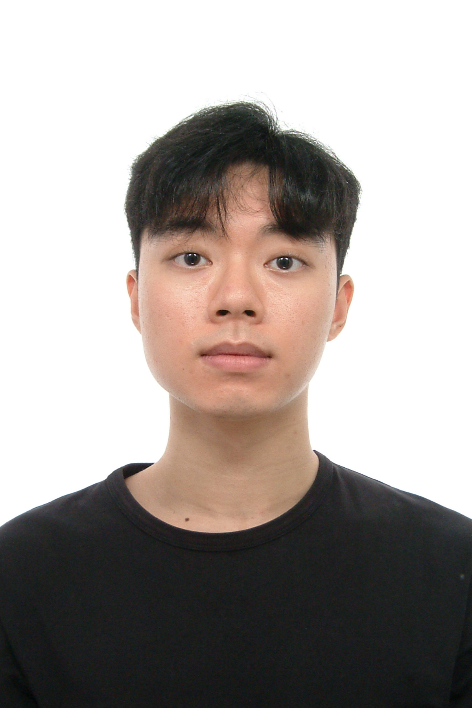
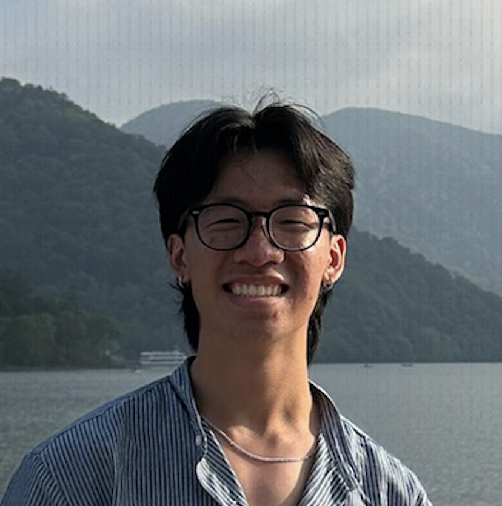
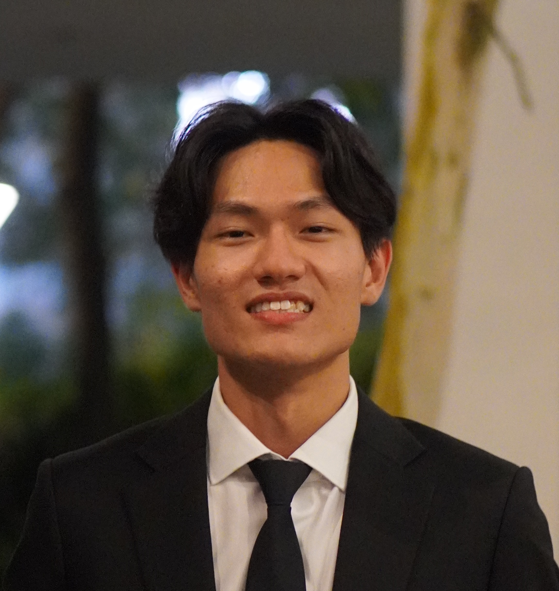

We are a team based in the [School of Computing, National University of Singapore](https://www.comp.nus.edu.sg).

You can reach any one of us at the email:
* `e1398360@u.nus.edu` (Jia Bao)
* `jessie.chin@u.nus.edu` (Jessie)
* `koei@u.nus.edu` (Kieron)
* `e1406319@u.nus.edu` (Lucas)
* `czh@u.nus.edu` (Zach)

## Project team

### Yoon Jia Bao

[[github](https://github.com/JBYoonn)]
[[portfolio](team/jbyoonn.md)]

* Role: Developer
* Responsibilities: 
  * GitHub Issue and Project Board Management, Release Management, Documentation
  * Storage Management

### Jessie Chin

[[github](https://github.com/jcc-kh)]
[[portfolio](team/jcc-kh.md)]

* Role: Developer
* Responsibilities:
  * Testing, Bug Reporting and Verification
  * Feature Implementation: Interview Scheduling

### Lucas Ng

[[github](http://github.com/lucasn24)]
[[portfolio](team/lucasn24.md)]

* Role: Developer
* Responsibilities:
  * UI Design and Implementation
  * Feature Implementation: Categories

### Kieron Oei

[[github](http://github.com/KieronOei)]
[[portfolio](team/kieronoei.md)]

* Role: Developer
* Responsibilities:
  * Project & Release Management
  * Documentation
  * Code refactoring
  * UI refinements

### Zach Chong

[[github](http://github.com/zachchong)]
[[portfolio](team/zachchong.md)]

* Role: Developer
* Responsibilities:
  * Documentation
  * Feature Implementation: Interview management
