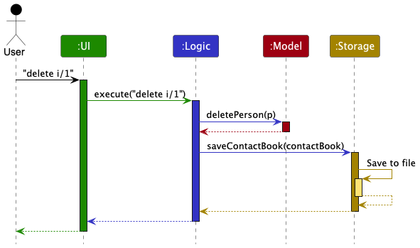
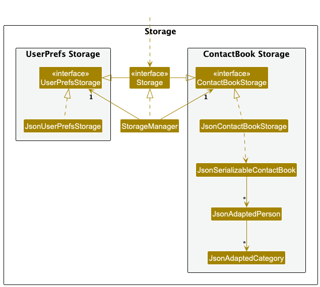
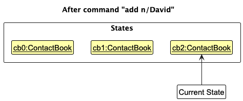
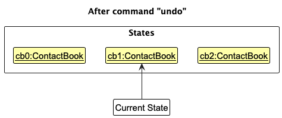
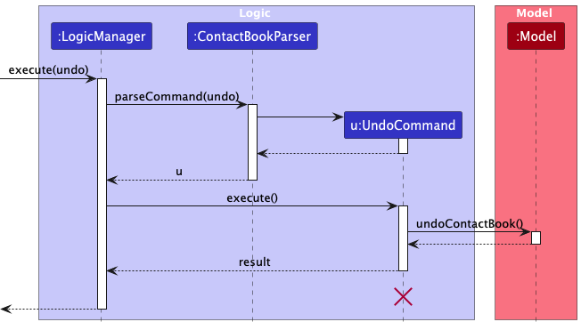
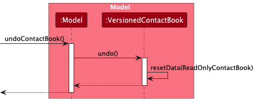
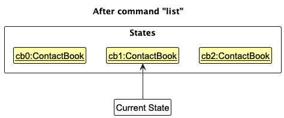
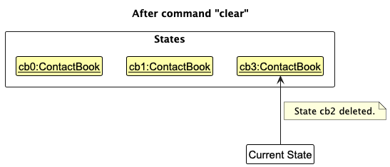
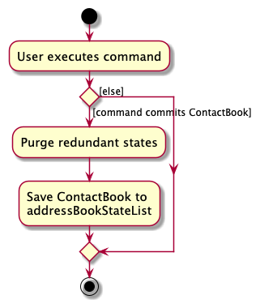

* Table of Contents
{:toc}

--------------------------------------------------------------------------------------------------------------------

## **Acknowledgements**

* {list here sources of all reused/adapted ideas, code, documentation, and third-party libraries -- include links to the original source as well}

--------------------------------------------------------------------------------------------------------------------

## **Setting up, getting started**

Refer to the guide [_Setting up and getting started_](SettingUp.md).

--------------------------------------------------------------------------------------------------------------------

## **Design**

:bulb: **Tip:** The `.puml` files used to create diagrams are in this document `docs/diagrams` folder. Refer to the [_PlantUML Tutorial_ at se-edu/guides](https://se-education.org/guides/tutorials/plantUml.html) to learn how to create and edit diagrams.

### Architecture

The ***Architecture Diagram*** given above explains the high-level design of the App.

Given below is a quick overview of main components and how they interact with each other.

**Main components of the architecture**

**`Main`** (consisting of classes [`Main`](https://github.com/se-edu/addressbook-level3/tree/master/src/main/java/seedu/address/Main.java) and [`MainApp`](https://github.com/se-edu/addressbook-level3/tree/master/src/main/java/seedu/address/MainApp.java)) is in charge of the app launch and shut down.
* At app launch, it initializes the other components in the correct sequence, and connects them up with each other.
* At shut down, it shuts down the other components and invokes cleanup methods where necessary.

The bulk of the app's work is done by the following four components:

* [**`UI`**](#ui-component): The UI of the App.
* [**`Logic`**](#logic-component): The command executor.
* [**`Model`**](#model-component): Holds the data of the App in memory.
* [**`Storage`**](#storage-component): Reads data from, and writes data to, the hard disk.

[**`Commons`**](#common-classes) represents a collection of classes used by multiple other components.

**How the architecture components interact with each other**

The *Sequence Diagram* below shows how the components interact with each other for the scenario where the user issues the command `delete 1`.

Each of the four main components (also shown in the diagram above),

* defines its *API* in an `interface` with the same name as the Component.
* implements its functionality using a concrete `{Component Name}Manager` class (which follows the corresponding API `interface` mentioned in the previous point.

For example, the `Logic` component defines its API in the `Logic.java` interface and implements its functionality using the `LogicManager.java` class which follows the `Logic` interface. Other components interact with a given component through its interface rather than the concrete class (reason: to prevent outside component's being coupled to the implementation of a component), as illustrated in the (partial) class diagram below.

The sections below give more details of each component.

### UI component

The **API** of this component is specified in [`Ui.java`](https://github.com/se-edu/addressbook-level3/tree/master/src/main/java/seedu/address/ui/Ui.java)

The UI consists of a `MainWindow` that is made up of parts e.g.`CommandBox`, `ResultDisplay`, `PersonListPanel`, `StatusBarFooter` etc. All these, including the `MainWindow`, inherit from the abstract `UiPart` class which captures the commonalities between classes that represent parts of the visible GUI.

The `UI` component uses the JavaFx UI framework. The layout of these UI parts are defined in matching `.fxml` files that are in the `src/main/resources/view` folder. For example, the layout of the [`MainWindow`](https://github.com/se-edu/addressbook-level3/tree/master/src/main/java/seedu/address/ui/MainWindow.java) is specified in [`MainWindow.fxml`](https://github.com/se-edu/addressbook-level3/tree/master/src/main/resources/view/MainWindow.fxml)

The `UI` component,

* executes user commands using the `Logic` component.
* listens for changes to `Model` data so that the UI can be updated with the modified data.
* keeps a reference to the `Logic` component, because the `UI` relies on the `Logic` to execute commands.
* depends on some classes in the `Model` component, as it displays `Person` object residing in the `Model`.

### Logic component

**API** : [`Logic.java`](https://github.com/se-edu/addressbook-level3/tree/master/src/main/java/seedu/address/logic/Logic.java)

Here's a (partial) class diagram of the `Logic` component:

The sequence diagram below illustrates the interactions within the `Logic` component, taking `execute("delete 1")` API call as an example.

:information_source: **Note:** The lifeline for `DeleteCommandParser` should end at the destroy marker (X) but due to a limitation of PlantUML, the lifeline continues till the end of diagram.

How the `Logic` component works:

1. When `Logic` is called upon to execute a command, it is passed to an `ContactBookParser` object which in turn creates a parser that matches the command (e.g., `DeleteCommandParser`) and uses it to parse the command.
1. This results in a `Command` object (more precisely, an object of one of its subclasses e.g., `DeleteCommand`) which is executed by the `LogicManager`.
1. The command can communicate with the `Model` when it is executed (e.g. to delete a person). 
   Note that although this is shown as a single step in the diagram above (for simplicity), in the code it can take several interactions (between the command object and the `Model`) to achieve.
1. The result of the command execution is encapsulated as a `CommandResult` object which is returned back from `Logic`.

Here are the other classes in `Logic` (omitted from the class diagram above) that are used for parsing a user command:

How the parsing works:
* When called upon to parse a user command, the `ContactBookParser` class creates an `XYZCommandParser` (`XYZ` is a placeholder for the specific command name e.g., `AddCommandParser`) which uses the other classes shown above to parse the user command and create a `XYZCommand` object (e.g., `AddCommand`) which the `ContactBookParser` returns back as a `Command` object.
* All `XYZCommandParser` classes (e.g., `AddCommandParser`, `DeleteCommandParser`, ...) inherit from the `Parser` interface so that they can be treated similarly where possible e.g, during testing.

### Model component
**API** : [`Model.java`](https://github.com/se-edu/addressbook-level3/tree/master/src/main/java/seedu/address/model/Model.java)

The `Model` component,

* stores the contact book data i.e., all `Person` objects (which are contained in a `UniquePersonList` object).
* stores the currently 'selected' `Person` objects (e.g., results of a search query) as a separate _filtered_ list which is exposed to outsiders as an unmodifiable `ObservableList<Person>` that can be 'observed' e.g. the UI can be bound to this list so that the UI automatically updates when the data in the list change.
* stores a `UserPref` object that represents the user’s preferences. This is exposed to the outside as a `ReadOnlyUserPref` objects.
* does not depend on any of the other three components (as the `Model` represents data entities of the domain, they should make sense on their own without depending on other components)

:information_source: **Note:** An alternative (arguably, a more OOP) model is given below. It has a `Category` list in the `ContactBook`, which `Person` references. This allows `ContactBook` to only require one `Category` object per unique category, instead of each `Person` needing their own `Category` objects. 

### Storage component

**API** : [`Storage.java`](https://github.com/se-edu/addressbook-level3/tree/master/src/main/java/seedu/address/storage/Storage.java)

The `Storage` component,
* can save both contact book data and user preference data in JSON format, and read them back into corresponding objects.
* inherits from both `ContactBookStorage` and `UserPrefStorage`, which means it can be treated as either one (if only the functionality of only one is needed).
* depends on some classes in the `Model` component (because the `Storage` component's job is to save/retrieve objects that belong to the `Model`)

### Common classes

Classes used by multiple components are in the `presspal.contact.commons` package.

--------------------------------------------------------------------------------------------------------------------

## **Implementation**

This section describes some noteworthy details on how certain features are implemented.

### \[Proposed\] Undo/redo feature

#### Proposed Implementation

The proposed undo/redo mechanism is facilitated by `VersionedContactBook`. It extends `ContactBook` with an undo/redo history, stored internally as an `contactBookStateList` and `currentStatePointer`. Additionally, it implements the following operations:

* `VersionedContactBook#commit()` — Saves the current contact book state in its history.
* `VersionedContactBook#undo()` — Restores the previous contact book state from its history.
* `VersionedContactBook#redo()` — Restores a previously undone contact book state from its history.

These operations are exposed in the `Model` interface as `Model#commitContactBook()`, `Model#undoContactBook()` and `Model#redoContactBook()` respectively.

Given below is an example usage scenario and how the undo/redo mechanism behaves at each step.

Step 1. The user launches the application for the first time. The `VersionedContactBook` will be initialized with the initial contact book state, and the `currentStatePointer` pointing to that single contact book state.

Step 2. The user executes `delete 5` command to delete the 5th person in the contact book. The `delete` command calls `Model#commitContactBook()`, causing the modified state of the contact book after the `delete 5` command executes to be saved in the `contactBookStateList`, and the `currentStatePointer` is shifted to the newly inserted contact book state.

Step 3. The user executes `add n/David …​` to add a new person. The `add` command also calls `Model#commitContactBook()`, causing another modified contact book state to be saved into the `contactBookStateList`.

:information_source: **Note:** If a command fails its execution, it will not call `Model#commitContactBook()`, so the contact book state will not be saved into the `contactBookStateList`.

Step 4. The user now decides that adding the person was a mistake, and decides to undo that action by executing the `undo` command. The `undo` command will call `Model#undoContactBook()`, which will shift the `currentStatePointer` once to the left, pointing it to the previous contact book state, and restores the contact book to that state.

:information_source: **Note:** If the `currentStatePointer` is at index 0, pointing to the initial ContactBook state, then there are no previous ContactBook states to restore. The `undo` command uses `Model#canUndoContactBook()` to check if this is the case. If so, it will return an error to the user rather
than attempting to perform the undo.

The following sequence diagram shows how an undo operation goes through the `Logic` component:

:information_source: **Note:** The lifeline for `UndoCommand` should end at the destroy marker (X) but due to a limitation of PlantUML, the lifeline reaches the end of diagram.

Similarly, how an undo operation goes through the `Model` component is shown below:

The `redo` command does the opposite — it calls `Model#redoContactBook()`, which shifts the `currentStatePointer` once to the right, pointing to the previously undone state, and restores the contact book to that state.

:information_source: **Note:** If the `currentStatePointer` is at index `contactBookStateList.size() - 1`, pointing to the latest contact book state, then there are no undone ContactBook states to restore. The `redo` command uses `Model#canRedoContactBook()` to check if this is the case. If so, it will return an error to the user rather than attempting to perform the redo.

Step 5. The user then decides to execute the command `list`. Commands that do not modify the contact book, such as `list`, will usually not call `Model#commitContactBook()`, `Model#undoContactBook()` or `Model#redoContactBook()`. Thus, the `contactBookStateList` remains unchanged.

Step 6. The user executes `clear`, which calls `Model#commitContactBook()`. Since the `currentStatePointer` is not pointing at the end of the `contactBookStateList`, all contact book states after the `currentStatePointer` will be purged. Reason: It no longer makes sense to redo the `add n/David …​` command. This is the behavior that most modern desktop applications follow.

The following activity diagram summarizes what happens when a user executes a new command:

#### Design considerations:

**Aspect: How undo & redo executes:**

* **Alternative 1 (current choice):** Saves the entire contact book.
  * Pros: Easy to implement.
  * Cons: May have performance issues in terms of memory usage.

* **Alternative 2:** Individual command knows how to undo/redo by
  itself.
  * Pros: Will use less memory (e.g. for `delete`, just save the person being deleted).
  * Cons: We must ensure that the implementation of each individual command are correct.

_{more aspects and alternatives to be added}_

### \[Proposed\] Data archiving

_{Explain here how the data archiving feature will be implemented}_

--------------------------------------------------------------------------------------------------------------------

## **Documentation, logging, testing, configuration, dev-ops**

* [Documentation guide](Documentation.md)
* [Testing guide](Testing.md)
* [Logging guide](Logging.md)
* [Configuration guide](Configuration.md)
* [DevOps guide](DevOps.md)

--------------------------------------------------------------------------------------------------------------------

## **Appendix: Requirements**

### Product scope

**Target user profile**:

* Primary users:
   * Breaking-news reporters in Singapore mainstream newsrooms who often handle a large number of contacts from different organisations and roles.

* Context:
   * They work under tight schedules, sometimes in the newsroom but often on-the-go, needing to recall and update information quickly while balancing multiple developing stories.

* Habits & skills:
   * Prefer desktop/laptop applications for speed.
   * Comfortable with command-line input and type quickly, preferring keyboard over mouse-driven interactions.
   * Used to handling structured yet scattered information (contacts, roles, organisations, interviews).

**Value proposition**: PressPal helps reporters manage scattered contacts with speed. It categorises relationships by role and organisation, tracks interviews and notes, and offers reminders for follow-ups. With timeline views, archiving contacts after each news, and smart command suggestions, it streamlines fast entry and retrieval, keeping reporters organised while chasing breaking stories.

### User stories

Priorities: High (must have) - `* * *`, Medium (nice to have) - `* *`, Low (unlikely to have) - `*`

| Priority | As a …         | I can …                                                                                 | So that I can…                                                            |
| -------- | -------------- | ------------------------------------------------------------------------------------------- | ------------------------------------------------------------------------- |
| `* * *`  | user           | create new contacts with the add contact functions (name, phone, email, organisation, role) | retrieve the contact easily when I need them                              |
| `* * *`  | user           | create a new category                                                                       | group all related contacts and interactions for easy reference.           |
| `* * *`  | user           | add existing contacts to categories                                                         | group related contacts for easy reference                                 |
| `* * *`  | user           | log interview dates in the contact                                                          | easily track and know my interview schedule                               |
| `* * *`  | user           | delete old contacts                                                                         | keep my contact book organised                                            |
| `* * *`  | user           | remove existing contacts from categories                                                    | keep my contact book organised                                            |
| `* * *`  | user           | delete interview dates in the contact                                                       | keep my schedule up to date and avoid confusion from outdated information |
| `* * *`  | user           | search contacts by their names                                                              | quickly find the specific person I’m looking for                          |
| `* *`    | user           | search contacts by their organisation                                                       | find a person from a specific organisation                                |
| `* *`    | user           | search contacts by their roles                                                              | find a person with related role                                           |
| `*`      | long-time user | archive contacts once a story wraps up                                                      | keep my dashboard uncluttered                                             |
| `*`      | long-time user | view a timeline of interview minutes for a story                                            | quickly see the sequence of events and conversations                      |

*{More to be added}*

## **Use cases**

(For all use cases below, the **System** is the `PressPal` and the **Actor** is the `Reporter`, unless specified otherwise)

### UC1 – Add a contact

**MSS**

1. Reporter requests to add a contact with name, at least one mode of contact (phone or email), organisation and role.
2. PressPal validates all provided fields.
3. PressPal creates the contact and confirms.

   Use case ends.

**Extensions**

* 1a. Reporter includes only some fields.
  * 1a1. PressPal requests the missing fields.
  * 1a2. Reporter provides them.
    Use case resumes at step 2.

* 2a. PressPal detects an invalid field (e.g., name/phone/email format).
  * 2a1. PressPal requests the corrected value and explains the issue.
  * 2a2. Reporter enters a corrected value.
    Steps 2a1–2a2 repeat until all values are valid.
    Use case resumes at step 2.

* 2b. PressPal detects that the phone or email already exists.
  * 2b1. PressPal informs that a duplicate contact exists.
  * 2b2. Reporter chooses to cancel.
    Use case ends.

* 2c. PressPal detects missing mode of contact.
  * 2c1. PressPal requests at least one mode of contact (phone or email).
  * 2c2. Reporter provides one.
    Use case resumes at step 2.

* 2d. PressPal detects a repeated parameter.
  * 2d1. PressPal requests a single value for the repeated parameter.
  * 2d2. Reporter provides the single value.
    Use case resumes at step 2.

* *a. At any time, Reporter chooses to cancel.
  * *a1. PressPal requests to confirm the cancellation.
  * *a2. Reporter confirms the cancellation.
    Use case ends.

### UC2 – Create a category

**MSS**

1. Reporter requests to create a category with a name.
2. PressPal validates the category name.
3. PressPal creates the category and confirms.

   Use case ends.

**Extensions**

* 1a. Reporter omits the category name.
  * 1a1. PressPal requests the category name.
  * 1a2. Reporter provides it.
    Use case resumes at step 2.

* 2a. PressPal detects an invalid name (e.g., empty or only symbols).
  * 2a1. PressPal requests a valid name and explains the issue.
  * 2a2. Reporter enters a valid name.
    Steps 2a1–2a2 repeat until valid.
    Use case resumes at step 2.

* 2b. PressPal detects that the category already exists (case-insensitive).
  * 2b1. PressPal informs that the category already exists.
    Use case ends.

* *a. At any time, Reporter chooses to cancel.
  * *a1. PressPal requests to confirm the cancellation.
  * *a2. Reporter confirms the cancellation.
    Use case ends.

### UC3 – Add contact to category

**MSS**

1. Reporter requests to add a contact to a category.
2. PressPal validates that the contact and category exist.
3. PressPal links the contact to the category and confirms.

   Use case ends.

**Extensions**

* 1a. Reporter provides only one of the required items (contact or category).
  * 1a1. PressPal requests the missing item.
  * 1a2. Reporter provides it.
    Use case resumes at step 2.

* 2a. Category not found.
  * 2a1. PressPal informs that the category does not exist and requests a valid one.
  * 2a2. Reporter provides it.
    Use case resumes at step 2.

* 2b. Contact not found.
  * 2b1. PressPal informs that the contact does not exist and requests a valid one.
  * 2b2. Reporter provides it.
    Use case resumes at step 2.

* 2c. Multiple contacts match the name.
  * 2c1. PressPal lists matches and requests disambiguation.
  * 2c2. Reporter selects one.
    Use case resumes at step 2.

* 2d. Contact is already in the category.
  * 2d1. PressPal informs that the link already exists.
    Use case ends.

* *a. At any time, Reporter chooses to cancel.
  * *a1. PressPal requests to confirm the cancellation.
  * *a2. Reporter confirms the cancellation.
    Use case ends.

### UC4 – Add interview to contact

**MSS**

1. Reporter requests to add an interview to a contact with header, date, and time.
2. PressPal validates the contact, header, and timestamp.
3. PressPal records the interview on the contact’s timeline and confirms.

   Use case ends.

**Extensions**

* 1a. Reporter includes only some fields.
  * 1a1. PressPal requests the missing fields.
  * 1a2. Reporter provides them.
    Use case resumes at step 2.

* 2a. Invalid date/time format or nonsensical timestamp.
  * 2a1. PressPal explains required formats and requests correction.
  * 2a2. Reporter provides corrected values.
    Repeat until valid.
    Use case resumes at step 2.

* 2b. Contact not found.
  * 2b1. PressPal informs that no such contact exists and requests a valid one.
  * 2b2. Reporter provides it.
    Use case resumes at step 2.

* 2c. Multiple contacts match the name.
  * 2c1. PressPal lists matches and requests disambiguation.
  * 2c2. Reporter selects one.
    Use case resumes at step 2.

* 2d. Duplicate timestamp detected.
  * 2d1. PressPal warns and requests a decision.
  * 2d2. Reporter chooses to proceed → Use case resumes at step 3.
  * 2d3. Reporter cancels → Use case ends.

* *a. At any time, Reporter chooses to cancel.
  * *a1. PressPal requests to confirm the cancellation.
  * *a2. Reporter confirms the cancellation.
    Use case ends.

### UC5 – Delete a contact

**MSS**

1. Reporter requests to delete a contact.
2. PressPal validates the specified contact.
3. PressPal deletes the contact and confirms.

   Use case ends.

**Extensions**

* 1a. Reporter does not specify the contact.
  * 1a1. PressPal requests the contact.
  * 1a2. Reporter provides it.
    Use case resumes at step 2.

* 2a. Invalid name format or contact not found.
  * 2a1. PressPal explains the issue and requests a valid contact.
  * 2a2. Reporter provides one.
    Use case resumes at step 2.

* 2b. Multiple contacts match the name.
  * 2b1. PressPal lists matches and requests disambiguation.
  * 2b2. Reporter selects one.
    Use case resumes at step 2.

* 3a. Storage error occurs during deletion.
  * 3a1. PressPal reports the failure and retains the contact.
    Use case ends.

* *a. At any time, Reporter chooses to cancel.
  * *a1. PressPal requests to confirm the cancellation.
  * *a2. Reporter confirms the cancellation.
    Use case ends.

### UC6 – Remove contact from category

**MSS**

1. Reporter requests to remove a contact from a category.
2. PressPal validates the contact, category, and that a link exists.
3. PressPal removes the link and confirms.

   Use case ends.

**Extensions**

* 1a. Reporter provides only one of the required items.
  * 1a1. PressPal requests the missing item.
  * 1a2. Reporter provides it.
    Use case resumes at step 2.

* 2a. Category not found.
  * 2a1. PressPal informs and requests a valid one.
  * 2a2. Reporter provides it.
    Use case resumes at step 2.

* 2b. Contact not found.
  * 2b1. PressPal informs and requests a valid one.
  * 2b2. Reporter provides it.
    Use case resumes at step 2.

* 2c. Multiple contacts match the name.
  * 2c1. PressPal lists matches and requests disambiguation.
  * 2c2. Reporter selects one.
    Use case resumes at step 2.

* 2d. Contact is not in the specified category.
  * 2d1. PressPal informs that no link exists.
    Use case ends.

* *a. At any time, Reporter chooses to cancel.
  * *a1. PressPal requests to confirm the cancellation.
  * *a2. Reporter confirms the cancellation.
    Use case ends.

### UC7 – Delete interview from contact

**MSS**

1. Reporter requests to delete an interview from a contact using date and time.
2. PressPal validates the contact and the timestamp.
3. PressPal deletes the interview entry and confirms.

   Use case ends.

**Extensions**

* 1a. Reporter omits required details (contact or date/time).
  * 1a1. PressPal requests missing details.
  * 1a2. Reporter provides them.
    Use case resumes at step 2.

* 2a. Invalid date/time format.
  * 2a1. PressPal explains required formats and requests correction.
  * 2a2. Reporter provides corrected values.
    Repeat until valid.
    Use case resumes at step 2.

* 2b. Contact not found.
  * 2b1. PressPal informs and requests a valid one.
  * 2b2. Reporter provides it.
    Use case resumes at step 2.

* 2c. Multiple contacts match the name.
  * 2c1. PressPal lists matches and requests disambiguation.
  * 2c2. Reporter selects one.
    Use case resumes at step 2.

* 2d. Interview at given timestamp not found.
  * 2d1. PressPal informs that no such interview exists.
    Use case ends.

* 3a. Storage error during deletion.
  * 3a1. PressPal reports the failure and retains the interview.
    Use case ends.

* *a. At any time, Reporter chooses to cancel.
  * *a1. PressPal requests to confirm the cancellation.
  * *a2. Reporter confirms the cancellation.
    Use case ends.

### UC8 – Search contacts

**MSS**

1. Reporter requests to search contacts by name.
2. PressPal validates the query.
3. PressPal displays the matching contacts.

   Use case ends.

**Extensions**

* 1a. Reporter omits the search query.
  * 1a1. PressPal requests a query.
  * 1a2. Reporter provides it.
    Use case resumes at step 2.

* 2a. Query contains invalid characters or is empty after normalization.
  * 2a1. PressPal requests a valid query and explains the issue.
  * 2a2. Reporter provides one.
    Repeat until valid.
    Use case resumes at step 2.

* 3a. No results found.
  * 3a1. PressPal informs that no contacts match.
    Use case ends.

* *a. At any time, Reporter chooses to cancel.
  * *a1. PressPal requests to confirm the cancellation.
  * *a2. Reporter confirms the cancellation.
    Use case ends.

## Non-Functional Requirements

1.  Should work on any _mainstream OS_ as long as it has Java `17` or above installed.
2.  Should be able to hold up to 1000 persons without a noticeable sluggishness in performance for typical usage.
3.  A user with above average typing speed for regular English text (i.e. not code, not system admin commands) should be able to accomplish most of the tasks faster using commands than using the mouse.

*{More to be added}*

## Glossary

* **Mainstream OS**: Windows, Linux, Unix, MacOS
* **Private contact detail**: A contact detail that is not meant to be shared with others
  This glossary defines key terms used within **PressPal**, a platform designed for breaking news journalists to manage and organize their contact information efficiently.

---

### A
**Account**:

A user profile in PressPal that stores a journalist’s credentials, preferences, and contact database.

### C
**Category**:

A label or grouping used to organize contacts (e.g., “Politics,” “Health,” “Technology”).

**Contact**:

An individual or organization entry stored in PressPal, including name, role, and at least one mode of contact (e.g., phone or email).

### D
**Duplicate contact**:

A contact that shares the same phone number or email as an existing contact in PressPal.

### M
**Mode of contact**:

A way to reach a contact, such as a phone number or email organisation.

### R
**Reporter**:

The primary user of PressPal who manages contacts, categories, and interview notes.

**Role**:

The position or job title of a contact within their organisation.

### O
**Organisation**:

The company, agency, or institution a contact belongs to.

## **Appendix: Instructions for manual testing**

Given below are instructions to test the app manually.

:information_source: **Note:** These instructions only provide a starting point for testers to work on;
testers are expected to do more *exploratory* testing.

### Launch and shutdown

1. Initial launch

   1. Download the jar file and copy into an empty folder

   1. Double-click the jar file Expected: Shows the GUI with a set of sample contacts. The window size may not be optimum.

1. Saving window preferences

   1. Resize the window to an optimum size. Move the window to a different location. Close the window.

   1. Re-launch the app by double-clicking the jar file. 
       Expected: The most recent window size and location is retained.

1. _{ more test cases …​ }_

### Deleting a person

1. Deleting a person while all persons are being shown

   1. Prerequisites: List all persons using the `list` command. Multiple persons in the list.

   1. Test case: `delete 1` 
      Expected: First contact is deleted from the list. Details of the deleted contact shown in the status message. Timestamp in the status bar is updated.

   1. Test case: `delete 0` 
      Expected: No person is deleted. Error details shown in the status message. Status bar remains the same.

   1. Other incorrect delete commands to try: `delete`, `delete x`, `...` (where x is larger than the list size) 
      Expected: Similar to previous.

1. _{ more test cases …​ }_

### Saving data

1. Dealing with missing/corrupted data files

   1. _{explain how to simulate a missing/corrupted file, and the expected behavior}_

1. _{ more test cases …​ }_
