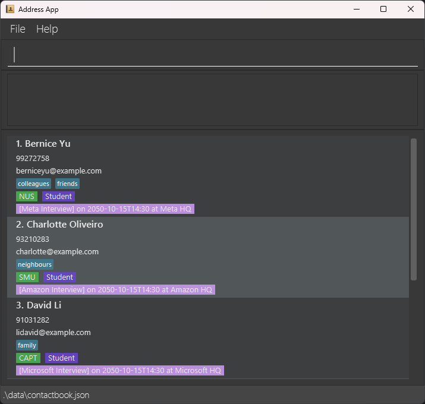
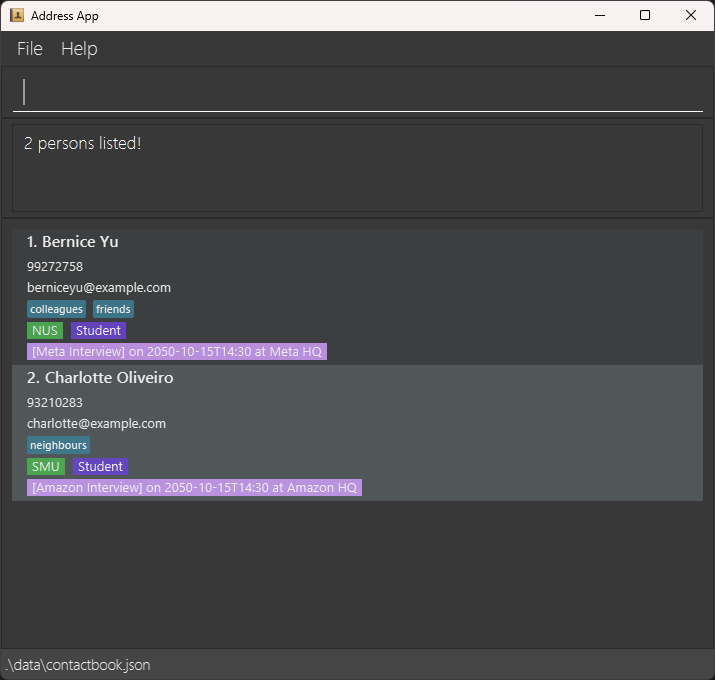

## Table of Contents
- [About](#about)
- [Quick Start](#quick-start)
- [Features](#features)
- [FAQ](#faq)
- [Known Issues](#known-issues)
- [Commands](#command-summary)

## About

PressPal is designed to streamline contact and interview management for breaking news reporters. Traditional address books and note-taking tools are not optimized for the high-speed, high-pressure environment of news reporting, where reporters must manage hundreds of contacts across multiple sources (phones, emails, notebooks).
The goal of PressPal is to:
- Provide reporters with a single command-driven system for organizing and retrieving contacts quickly.
- Enable fast entry and retrieval of context (interview history, organization, role, notes) while working on multiple stories simultaneously.
- Support the entire lifecycle of a contact — from initial outreach, to active follow-up, to archiving once a story concludes.
  Ultimately, PressPal aims to reduce cognitive load for reporters, allowing them to focus on storytelling while ensuring no lead, contact, or follow-up is lost.

### User Profiles
- Users with basic familiarity with Windows/macOS/Linux file navigation and opening a terminal.
- Users who favor CLI over GUI and type quickly.
- Users who manage an extensive network of contacts and numerous scheduled interviews to monitor.

### System Requirements
- Java 17 (or newer) installed and available on the PATH.
- Operating System: Windows, macOS, or Linux.

--------------------------------------------------------------------------------------------------------------------

## Quick start

1. Ensure you have Java `17` or above installed in your Computer.<br>
   **Mac users:** Ensure you have the precise JDK version prescribed [here](https://se-education.org/guides/tutorials/javaInstallationMac.html).

1. Download the latest `.jar` file from [here](https://github.com/AY2526S1-CS2103T-W08-1/tp/releases/tag/v1.3).

1. Copy the file to the folder you want to use as the _home folder_ for your ContactBook.

1. Open a command terminal, `cd` into the folder you put the jar file in, and use the `java -jar presspal.jar` command to run the application.<br>
   A GUI similar to the below should appear in a few seconds. Note how the app contains some sample data.<br>
   

1. Type the command in the command box and press Enter to execute it. e.g. typing **`help`** and pressing Enter will open the help window.<br>
   Some example commands you can try:

   * `list` : Lists all contacts.

   * `add n/John Doe p/98765432 e/johnd@example.com r/Student o/NUS c/friends c/owesMoney` : Adds a contact named `John Doe` to the Contact Book.

   * `delete 3` : Deletes the 3rd contact shown in the current list.

   * `clear` : Deletes all contacts.

   * `exit` : Exits the app.

1. Refer to the [Features](#features) below for details of each command.

--------------------------------------------------------------------------------------------------------------------

## Features

<div markdown="block" class="alert alert-info">

**:information_source: Notes about the command format:**<br>

* Words in `UPPER_CASE` are the parameters to be supplied by the user.<br>
  e.g. in `add n/NAME`, `NAME` is a parameter which can be used as `add n/John Doe`.

* Items in square brackets are optional.<br>
  e.g `n/NAME [c/CATEGORY]` can be used as `n/John Doe c/friend` or as `n/John Doe`.

* Items with `…`​ after them can be used multiple times including zero times.<br>
  e.g. `[c/CATEGORY]…​` can be used as ` ` (i.e. 0 times), `c/friend`, `c/friend c/family` etc.

* Parameters can be in any order.<br>
  e.g. if the command specifies `n/NAME p/PHONE_NUMBER`, `p/PHONE_NUMBER n/NAME` is also acceptable.

* Extraneous parameters for commands that do not take in parameters (such as `help`, `list`, `exit` and `clear`) will be ignored.<br>
  e.g. if the command specifies `help 123`, it will be interpreted as `help`.

* If you are using a PDF version of this document, be careful when copying and pasting commands that span multiple lines as space characters surrounding line-breaks may be omitted when copied over to the application.
</div>

### <u>GENERAL COMMANDS</u>

### Viewing help : `help`

### Viewing help : `help`
Shows a message explaining how to access the help page.


> **Format**
> ```
> help
> ```

### Clearing all entries : `clear`

Clears all entries from the contact book.

** :warning: Caution:** This action is destructive and cannot be undone.

> **Format**
> ```
> clear
> ```
### Clearing all entries : `clear`

Clears all entries from the contact book.

Format: `clear`

### Exiting the program : `exit`

Exits the program.

> **Format**
> ```
> exit
> ```
Format: `exit`

### <u>CONTACT MANAGEMENT</u>

### Adding a person: `add`

Adds a person to the contact book.
* You must provide at least one of `PHONE` and `EMAIL`.
* `PHONE` and `EMAIL` do not have to be unique. Different people can share the same contact details.

> **Format**
> ```
> add n/NAME p/PHONE_NUMBER e/EMAIL o/ORGANISATION r/ROLE [c/CATEGORY]
> ```

<div markdown="span" class="alert alert-primary">:bulb: **Tip:**
A person can have any number of categories (including 0).
</div>

Examples:
* `add n/John Doe p/98765432 e/johnd@example.com o/NUS r/Student c/friends c/owesMoney`
* `add n/Betsy Crowe p/12345678 e/betsycrowe@example.com o/Reuters r/Reporter`

### Editing a person : `edit`

Edits an existing person in the contact book.

> **Format**
> ```
> edit INDEX [n/NAME] [p/PHONE] [e/EMAIL] [o/ORGANISATION] [r/ROLE]
> ```

### Deleting a person : `delete`

Deletes the specified person from the contact book.

> **Format**
> ```
> delete INDEX
> ```

* Deletes the person at the specified `INDEX`.
* The index refers to the index number shown in the displayed person list.
* The index **must be a positive integer** 1, 2, 3, …​

Examples:
* `list` followed by `delete 2` deletes the 2nd person in the contact book.
* `find Betsy` followed by `delete 1` deletes the 1st person in the results of the `find` command.

### Listing all persons : `list`

Shows a list of all persons in the contact book.

> **Format**
> ```
> list
> ```


* Edits the person at the specified `INDEX`. The index refers to the index number shown in the displayed person list. The index **must be a positive integer** 1, 2, 3, …​
* At least one of the optional fields must be provided.
* Existing values will be updated to the input values.

Examples:
*  `edit 1 p/91234567 e/johndoe@example.com` Edits the phone number and email of the 1st person to be `91234567` and `johndoe@example.com` respectively.

### Deleting a person : `delete`

Deletes the specified person from the contact book.

Format: `delete INDEX`

* Deletes the person at the specified `INDEX`.
* The index refers to the index number shown in the displayed person list.
* The index **must be a positive integer** 1, 2, 3, …​

Examples:
* `list` followed by `delete 2` deletes the 2nd person in the contact book.
* `find Betsy` followed by `delete 1` deletes the 1st person in the results of the `find` command.

### Listing all persons : `list`

Shows a list of all persons in the contact book.

Format: `list`

### Locating persons by name, organisation, role, or categories : `find`

Finds persons whose name, organisation, role or categories contain any of the given keywords.

> **Format** 
> ```
> find KEYWORD [MORE_KEYWORDS]
> ```

* The search is case-insensitive. e.g `hans` will match `Hans`.
* The order of the keywords does not matter. e.g. `Hans Bo` will match `Bo Hans`.
* Only the name, organisation, role and categories are searched. Other fields such as phone or email are not included.
* Only full words will be matched e.g. `Han` will not match `Hans`.
* Persons matching at least one keyword will be returned (i.e. `OR` search).
  e.g. `Hans Bo` will return `Hans Gruber`, `Bo Yang`.

Examples:
* `find John` returns `john` and `John Doe`.
* `find bernice charlotte` returns `Bernice Yu`, `Charlotte Oliveiro`.<br>
  
* `find NUS colleagues` Returns all persons whose details match the keyword of `NUS` or `colleagues`.

### <u>INTERVIEW MANAGEMENT</u>

### Adding an interview to a contact : `addInterview`

Adds an interview to a contact in the contact book.

> **Format**
> ```
> addInterview i/INDEX h/HEADER d/DATE t/TIME l/LOCATION
> ```

* Adds an interview to the contact at the specified `INDEX`. The index refers to the index number shown in the displayed person list. The index **must be a positive integer** 1, 2, 3, …​
* The `DATE` must be in the format `YYYY-MM-DD`. e.g. `2025-10-10`.
  * When adding an interview, the `DATE` can be in the past.
* The `TIME` must be in the format `HH:MM`. e.g. `14:30`. 
  * Each contact cannot have more than one interview at the same time. However, different contacts can have interviews at the same time.
* The `LOCATION` can be any text describing where the interview will take place. 
  * Different interviews can take place at the same `LOCATION`.
* The `HEADER` can be any text describing the interview (e.g company name, role, etc.). 
  * Different interviews can have the same `HEADER`.

Examples:
* `addInterview i/1 h/Interview with ABC Corp d/2024-10-10 t/14:00 l/123, Business St, #02-25` adds an interview with header `Interview with ABC Corp`, date `2024-10-10`, time `14:00` and location `123, Business St, #02-25` to the 1st contact in the contact book.

### Deleting an interview from a contact : `deleteInterview`

Deletes an interview from a contact in the contact book.

> **Format** 
> ```
> deleteInterview i/PERSON_INDEX i/INTERVIEW_INDEX
> ```

* Deletes the interview at the specified `INTERVIEW_INDEX` from the contact at the specified `PERSON_INDEX`. The indices refer to the index numbers shown in the displayed person list and interview list respectively. The indices **must be positive integers** 1, 2, 3, …​

Examples:
* `deleteInterview i/1 i/2` Deletes the 2nd interview from the 1st contact in the contact book.

### Listing all interviews of a contact : `listInterview`

Lists all interviews of a contact in the contact book.

> **Format** 
> ```
> listInterview i/INDEX
> ```

* Lists all interviews of the contact at the specified `INDEX`. The index refers to the index number shown in the displayed person list. The index **must be a positive integer** 1, 2, 3, …​
* If the contact has no interviews, a message indicating so will be shown instead.


### Display the upcoming interview : `nextInterview`

Displays the next scheduled interview that occurs at or after the current date and time, excluding any interviews already in the past.
* If the next scheduled interview occurs for more than one contact, they will all be displayed.

> **Format**
> ```
> nextInterview
> ```

Format: `nextInterview`

Examples:
* `nextInterview` Displays the most upcoming scheduled interview "[Meta Interview] on 15 Oct 2050 2:30PM at Meta HQ."

### <u>CATEGORY MANAGEMENT</u>

### Add category(s) to a person : `addCat`

Add category(s) to a person identified by the index number used in the displayed person list.

> **Format** 
> ```
> addCat i/INDEX [c/CATEGORY]...
> ```

* If category A is already added to a person, any attempt to add category A again to the person will be rejected with an error message.

Examples:
* `addCat i/1 c/emergency` Adds the category `emergency` to the person with index 1.
* `addCat i/2 c/emergency c/singapore` Adds the categories `emergency` and `singapore` to the person with index 2.

### Delete category(s) from a person : `deleteCat`

Delete category(s) from a person identified by the index number used in the displayed person list.

> **Format** 
> ```
> deleteCat i/INDEX [c/CATEGORY]...
> ```

Examples:
* `deleteCat i/1 c/emergency` Deletes the category `emergency` from the person with index 1.
* `deleteCat i/2 c/emergency c/singapore` Deletes the categories `emergency` and `singapore` from the person with index 2.

### Saving the data

ContactBook data are saved in the hard disk automatically after any command that changes the data. There is no need to save manually.

--------------------------------------------------------------------------------------------------------------------

## Frequently Asked Questions (FAQ)

**Q**: How do I transfer my data to another Computer?<br>
**A**: Install the app in the other computer and overwrite the empty data file it creates with the file that contains the data of your previous ContactBook home folder.

--------------------------------------------------------------------------------------------------------------------

## Common Problems and Fixes

1. **App opens off-screen after disconnecting a monitor**
    - **Why it happens:** The app remembers its last position — even if that screen is gone.
    - **Fix:** Delete the `preferences.json` file before reopening the app.
### Troubleshooting

**Q**: I’ve found a bug. How can I report it?<br>
**A**: You can report it to any one of the developers. Their emails can be found in the [AboutUs page](AboutUs.md).

**Q**: I have an idea for a new feature. Where should I suggest it?<br>
**A**: You can give your suggestions to any one of the developers. Their emails can be found in the [AboutUs page](AboutUs.md).


### Features

**Q**: Why does `addInterview` allow past interview dates?<br>
**A**: This is to allow the user to archive past interviews to keep as reference.

**Q**: Why can I schedule two interviews at the same date and time?<br>
**A**: We understand that there might be a chance that multiple people can join in for the same interview, hence we allowed for duplicate interview times for different people.

2. **Help window doesn’t reopen after being minimized**
    - **Why it happens:** The app keeps the original Help Window minimized.
    - **Fix:** Manually restore the minimized window.
--------------------------------------------------------------------------------------------------------------------

## Future Iteration Plans

In future iterations, these are the features we plan to implement:
1. Archive of contact and interviews

After a certain period, there are contacts that may no longer be relevant to the journalist. An archiving feature would allow users to move such contacts to an archive section, keeping the main contact list uncluttered while still retaining access to past contacts if needed.
2. Enforcement of uniqueness on phone and email

Currently, the application allows multiple contacts to share the same phone number or email address. Implementing uniqueness constraints would help prevent duplicate entries and ensure that each contact is distinct, cohering with real-world scenarios where phone numbers and email addresses are unique identifiers.

3. Interview notes

Adding a feature to attach notes to interviews would be beneficial for journalists to jot down important points, observations, or follow-up questions related to each interview. This would allow journalist to use PressPal as the only tool needed to manage both contacts and interview details comprehensively.

--------------------------------------------------------------------------------------------------------------------

## Command summary

Action | Format, Examples
--------|------------------
**Add** | `add n/NAME p/PHONE e/EMAIL o/ORGANISATION r/ROLE [c/CATEGORY]…​` <br> e.g., `add n/John Doe p/98765432 e/johnd@example.com o/NUS r/Student c/friends c/owesMoney`
**Clear** | `clear`
**Delete** | `delete INDEX`<br> e.g., `delete 3`
**Edit** | `edit INDEX [n/NAME] [p/PHONE_NUMBER] [e/EMAIL] [o/ORGANISATION] [r/ROLE]​`<br> e.g.,`edit 2 n/James Lee e/jameslee@example.com`
**Find** | `find KEYWORD [MORE_KEYWORDS]`<br> e.g., `find James NUS Student`
**List** | `list`
**AddInterview** | `addInterview i/INDEX h/HEADER d/DATE t/TIME l/LOCATION` <br> e.g., `addInterview i/1 h/Interview with ABC Corp d/2024-10-10 t/14:00 l/123, Business St, #02-25`
**DeleteInterview** | `deleteInterview i/PERSON_INDEX i/INTERVIEW_INDEX` <br> e.g., `deleteInterview i/1 i/2`
**ListInterview** | `listInterview i/INDEX` <br> e.g., `listInterview i/1`
**AddCat** | `addCat i/INDEX [c/CATEGORY]...`<br>e.g., `addCat i/1 c/emergency` |
**DeleteCat** | `deleteCat i/INDEX [c/CATEGORY]...`<br>e.g., `deleteCat i/1 c/emergency` |
**NextInterview** | `nextInterview` |
**Exit** | `exit`
**Help** | `help`
